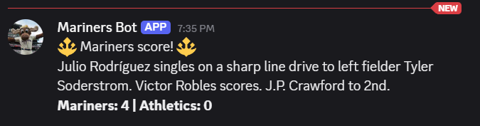
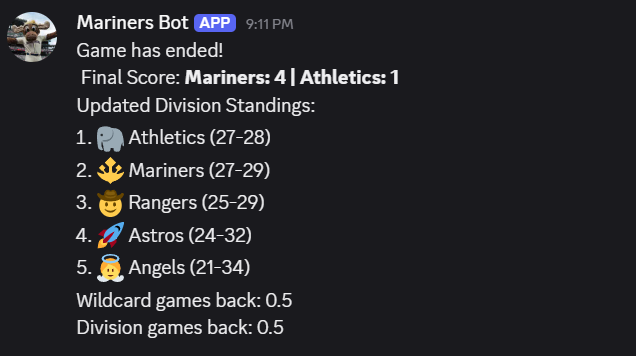
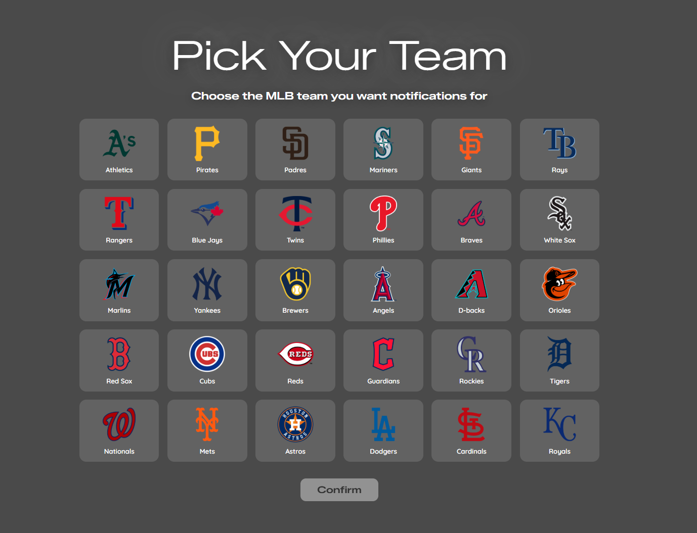
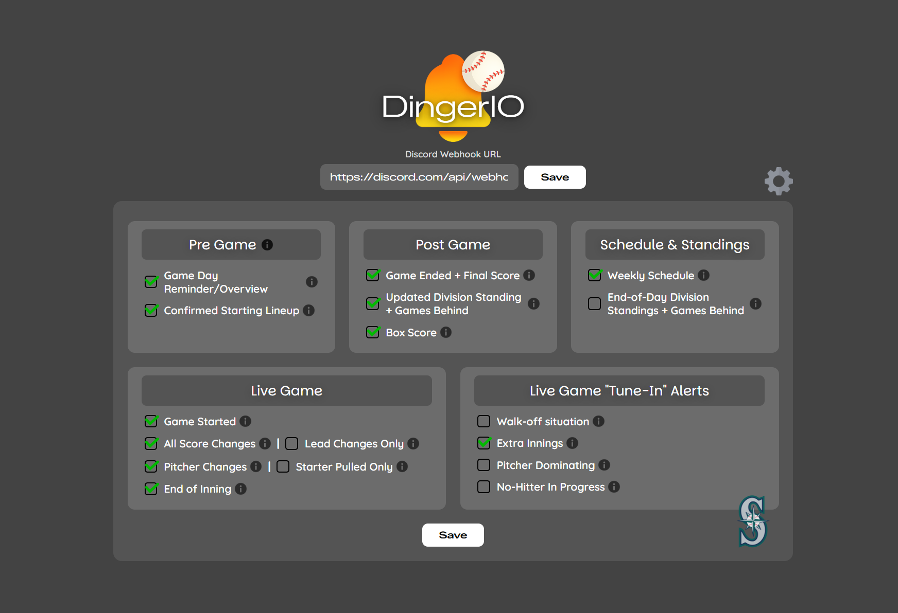

# DingerIO
## Summary
DingerIO is a passion project I developed to help users stay up to date with Major League Baseball games. Since each team in the MLB plays 162 games in a season, it can be difficult to consistently keep track of how your team is performing. As someone who has recently started getting more into baseball, I often find myself checking my team’s standings, playoff positioning, and how certain players are performing throughout the season. DingerIO helps to eliminate the tedious work of constantly looking up stats and results by serving real-time updates straight to a user's Discord server via webhook.

One of the main features of DingerIO is personalization. Fans care more about different parts of the game than others, so I designed the application to allow users to customize exactly which notifications they want to receive. Through a simple frontend dashboard, users can toggle different notification events on or off. For example, someone may only want notifications when a game starts and ends along with the final score, while another user may want updates about standings and playoff positioning after every game. Users can mix and match notification events to create a personalized experience centered around the aspects of baseball they care about most.

### Team Selection Menu

### Notification Selection Dashboard

---

## How It Works
DingerIO works by connecting to the official MLB Stats API (free and open for use), which provides live game data, team information, and full player rosters for every team in the league. When the application first starts up, it syncs and stores all 30 MLB teams and their rosters into a local database, so subscription lookups are fast and don't require repeated calls to the external API.

From there, the backend runs two scheduled processes. The first runs every Monday morning and fetches the upcoming 7-day schedule for each subscribed team, sending users a preview of their team's games for the week. The second is the main polling loop, which runs every 15 seconds throughout the day. On each cycle, it fetches the schedule for the current date to get a list of all games being played that day. For each game, it checks which users are subscribed to either team and routes the game through one of three handlers depending on its status.

If a game hasn't started yet, the pre-game handler checks how far away the first pitch is. A game day reminder is sent a few hours before the game, and a second notification is sent within minutes of the first pitch. Once a game is live, the live game handler fetches the full real-time game feed and compares it against the last recorded state. If anything has changed — a run scored, a new pitcher entered, an inning ended — it sends the appropriate notification to every subscribed user who has that event turned on. When a game ends, the final score is sent along with updated division standings if the user has that event enabled. If a game is postponed, a notification is sent letting users know it will not be played that day.

To prevent duplicate notifications, each game tracks a state object that records the current score, inning, and active pitchers. A notification is only sent when a change is detected from the previously recorded state

## Tech Stack
- **Java / Spring Boot** — backend application and scheduling
- **PostgreSQL** — persistent storage for users, teams, players, and subscriptions
- **MLB Stats API** — source for live game data and roster information
- **Discord Webhooks** — delivery channel for real-time notifications
- **React** — frontend dashboard for managing notification preferences
- **Vite** — frontend build tool and development server
- **JWT (JSON Web Tokens)** — stateless user authentication

---

## Status
Majority of planned features have been implemented and are operating as intended. Next step are adding the remaining notification events and deploying the application and database to a cloud server so that the application does not need to be run locally.
